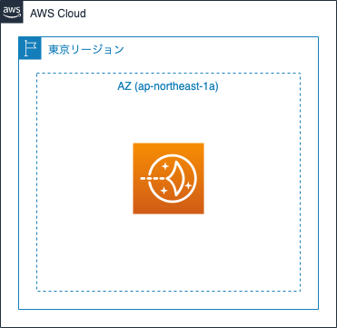
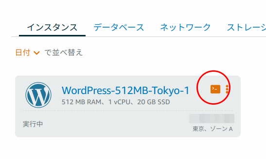

# Amazon LightsailでWordPressサーバを簡単に立ち上げてみよう

## 概要

このハンズオンでは、AWSマネジメントコンソールを通した
Amazon Lightsailの使用を行います。

Amazon LightsailはVPS(Virtual Private Server)サービスです。
Amazon Lightsailを使用すると、Amazon EC2より簡単にサーバを立ち上げることができます。
またテンプレートを使うことですでにアプリケーションがインストールされた状態で立ち上げることもできます。
今回はWordPressテンプレートを使って、簡単にWordPressのサーバを立ち上げてみます。

## 目的

このハンズオンでは、以下のことを行います。

- Amazon LightsailでWordPressサーバを起動する
- サーバインスタンスにログインする
- WordPressの初期設定をする

## 全体図



## AWSマネジメントコンソールにアクセスする

1. [AWSのWebサイト](https://aws.amazon.com/jp/)にアクセスし、
    サイト右上にある「コンソールへログイン」をクリックします。
2. ログイン画面です。IAMユーザは「アカウント」には「アカウントID」を入れ、ユーザとパスワードにはIAMユーザのユーザ名とパスワードを入力します。
    ルートアカウントは、ユーザ名にルートアカウントのメールアドレスを入れ、パスワードにはルートアカウントのパスワードを入れます。
    必要事項を入力したら、「サインイン」をクリックします。
    - 多要素認証が有効な場合は、次の画面で認証トークンを入力します。
3. AWSマネジメントコンソールのトップページが開いたら完了です。

## 作業1: Amazon LightsailでWordPressサーバを起動する

早速ですが、Amazon LightsailでWordpressサーバを起動してみましょう。

1. AWSマネジメントコンソールで右側に「東京」と表示されているか確認します。
    - 別のリージョン名が表示されていない場合は、リージョン名をクリックし「アジアパシフィック (東京)」を選択します。
2. AWSマネジメントコンソールで「サービス」から「Lightsail」をクリックします。
    - Lightsail専用の管理画面が起動します。
    - （管理画面の表示言語を変えたい場合は右下から変更できます）
3. 「インスタンスの作成」をクリックします。
4. 以下の設定をします。
    - 「インスタンスロケーション」で「東京、ゾーンA (ap-northeast-1a)」になっていることを確認します。
        - なっていない場合、「AWSリージョンとアベイラビリティーゾーンの変更」をクリックし、以下の変更をします。
            - リージョンの変更: 「東京 ap-northeast-1」を選択
            - アベイラビリティゾーンの変更: 「ゾーンA ap-northeast-1a」を選択
    - 「プラットフォームの選択」で、「Linux/Unix」を選択
    - 「設計図の選択」で、「アプリ+OS」を選択し、「WordPress」を選択
        - このWordPressは、Bitnamiが提供しているWordPressイメージになります。
    - 「インスタンスタイプ」はデフォルトのままです。
        - 「月次料金」/「$3.50 USD」となっているもの（最初の1ヶ月無料）
    - 「インスタンスの識別」はデフォルトのままです。
        - 「WordPress-512MB-Tokyo-1」というインスタンス名が設定されています。
5. 「インスタンスの作成」をクリックします。
    - ステータスが「実行中」になるまで、しばらく待ちます。
6. 起動したインスタンス「WordPress-512MB-Tokyo-1」にパブリックIPアドレスが付与されているので、そのIPアドレスでWebブラウザでアクセスします。
    - WordPressのサイトが閲覧できればOKです。

このように、簡単にWordPressサイトが起動できました。

なお、このWordPressイメージは「Bitnami」が提供しているものですので、
中身の詳細は[Bitnamiのドキュメント](https://docs.bitnami.com/aws/apps/wordpress/)をご確認ください。

## 作業2: サーバインスタンスにログインする

`<IPアドレス>/wp-login.php`で管理画面にアクセスできますが、
ユーザ名とパスワードがわかりません。
BitnamiのWordPressイメージでは、ユーザ名は`user`という名前がデフォルトなのですが、
パスワードはサーバインスタンスにログインしないとわかりません。

ここでは、サーバインスタンスにログインして、WordPressログインパスワードを確認しましょう。
各自のSSHクライアント (OpenSSH、Tera Term、PuTTY、etc.) を使用してSSHログインが可能ですが、
今回は、LightsailコンソールからWebブラウザ経由でインスタンスにログインしてみます。

1. インスタンス一覧のコンソールアイコンをクリックします。

2. 別ウィンドウが立ち上がり、SSHセッションが起動します。
3. 無事インスタンスに接続できればOKです。
    - インスタンス起動直後は接続に失敗する場合があります。その場合は時間をあけて再接続してください。

サーバインスタンスにログインできたら、
ログインしたディレクトリに`bitnami_application_password`というファイルがあり、
この中にWordPressの管理画面へのパスワードが記述されているので確認しましょう。

```bash
cat bitnami_application_password
```

パスワードをクリップボードにコピーする場合には、コンソールウィンドウの右下にあるアイコンをクリックするとコピーできます。

パスワードが確認できたら、WordPressの管理画面にログインしてみましょう。

1. Webブラウザで`<IPアドレス>/wp-login.php`にアクセスします。
2. 以下のように入力してログインします。
    - Username: user
    - Password: 先ほど調べた文字列
3. ログインできればOKです。

ちなみに、WordPress管理画面の言語を日本語に変えたい方は、
「Settings」から「Site Language」を「日本語」に変更して「Save Changes」をクリックしてみましょう。

## 作業3: インスタンスを削除する

最後に、インスタンスを削除して後片付けをしましょう。

1. インスタンス一覧画面から先ほど作成したインスタンスの右上にある「…」をクリックし、「削除」をクリックします。
2. 「はい、削除します」をクリックします。
3. しばらくすると、インスタンス一覧から削除されます。

以上です。
お疲れ様でした。

---

## mysqlのバックアップ

今回のサーバイメージの中にmysqlデータベースも起動しており、
データはそこに保存されています。

[Bitnamiのドキュメント](https://docs.bitnami.com/aws/apps/wordpress/administration/backup-restore-mysql-mariadb/)を参考に、
DBのバックアップをしてみましょう。

### フルダンプバックアップ

1. 以下のコマンドを実行します。
    ```bash
    mysqldump -A -u root -p > backup.sql
    ```
2. `Enter password:`と表示されたら、bitnamiの管理画面アクセスで調べたパスワード文字列を入力します。
    - 画面上にはパスワード文字列は表示されません。

backup.sqlがバックアップファイルです。
中身を見て、各種SQL文がたくさん記述されていれば完了です。

### リストア

1. 以下のコマンドを実行します。
    ```bash
    mysql -u root -p < backup.sql
    ```
2. `Enter password:`と表示されたら、bitnamiの管理画面アクセスで調べたパスワード文字列を入力します。
    - 画面上にはパスワード文字列は表示されません。

