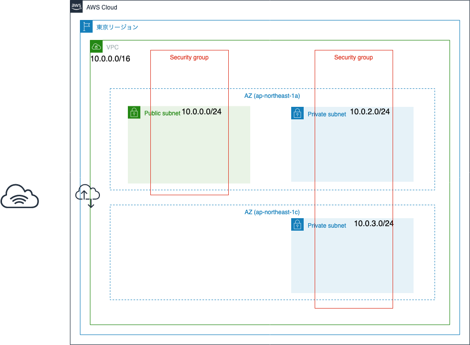
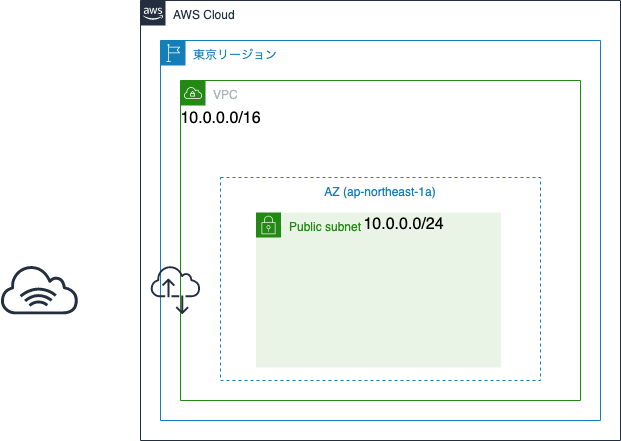
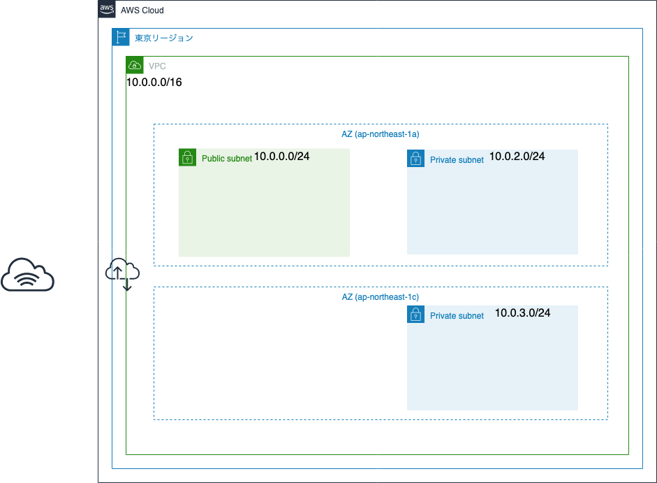
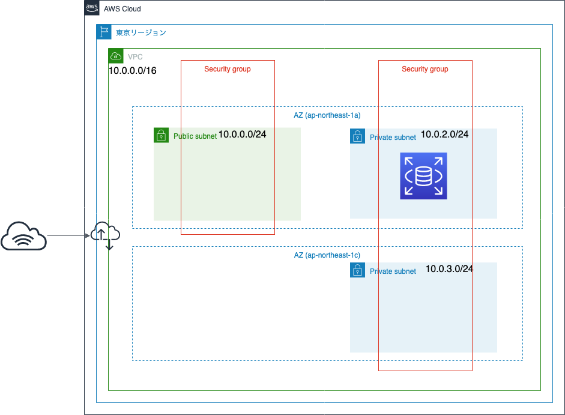
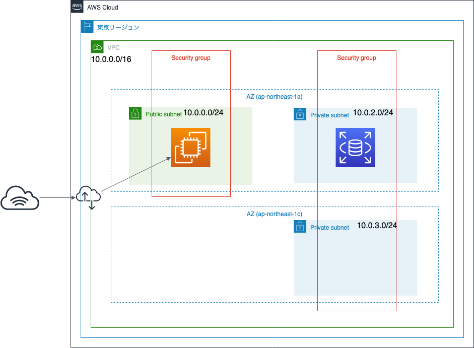

# Amazon EC2でWordPressサイトを立ち上げてみよう

## 概要

このハンズオンでは、AWSマネジメントコンソールを通した
Amazon EC2の使用を行います。

Amazon EC2を使用すると、様々な用途に対して、柔軟にサーバを立ち上げることができます。
またマーケットプレイスに公開されているAMIを使うことで、
すでにアプリケーションがインストールされた状態で立ち上げることもできます。
今回はWordPressがすでにインストール済みのAMIを使って、WordPressのサーバを立ち上げてみます。
最初に、Amazon EC2のインスタンス1台を使って、WordPressサーバを起動します。
次に、Amazon RDSを使って、DBサーバをWebサーバと別にする構成もやってみます。
これにより、DBサーバの運用負荷を軽減することができます。

Amazon LightsailとEC2の違いを意識しながら、
サーバ環境を構築してみましょう。

## 目的

このハンズオンでは、以下のことを行います。

- Amazon VPCでEC2を起動するためのネットワークを定義する
- Amazon EC2でWordPressサーバを起動する
- EC2インスタンスにSystems Managerでシェルアクセスする
- Amazon RDSでMySQL DBサーバを起動する

## 全体図


## AWSマネジメントコンソールにアクセスする

1. [AWSのWebサイト](https://aws.amazon.com/jp/)にアクセスし、
    サイト右上にある「コンソールへログイン」をクリックします。
2. ログイン画面です。IAMユーザは「アカウント」には「アカウントID」を入れ、ユーザとパスワードにはIAMユーザのユーザ名とパスワードを入力します。
    ルートアカウントは、ユーザ名にルートアカウントのメールアドレスを入れ、パスワードにはルートアカウントのパスワードを入れます。
    必要事項を入力したら、「サインイン」をクリックします。
    - 多要素認証が有効な場合は、次の画面で認証トークンを入力します。
3. AWSマネジメントコンソールのトップページが開いたら完了です。

## 作業1: Amazon VPCでEC2を起動するためのネットワークを定義する

EC2は、VPCで定義したネットワーク上で起動することができます。
AWSでは「デフォルトVPC」がすでに作成されていますが、
今回はインターネットに接続できるようなVPCを新規作成します。
また、VPCにサブネットを定義します。
ファイアウォールとなるセキュリティグループも定義しましょう。



### 1-1. VPCとパブリックサブネットの作成

まず、VPCを作成しましょう。

1. AWSマネジメントコンソールで右側に「東京」と表示されているか確認します。
    - 別のリージョン名が表示されていない場合は、リージョン名をクリックし「アジアパシフィック (東京)」を選択します。
2. AWSマネジメントコンソールで「サービス」から「VPC」をクリックします。
    - VPCダッシュボード画面が表示されます。
3. 「VPCウィザードの起動」をクリックします。
4. 「1個のパブリックサブネットを持つVPC」を選択し、「選択」をクリックします。
5. 以下の設定をして、「VPCの作成」をクリックします。
    - IPv4 CIDR ブロック: 10.0.0.0/16 (デフォルトのまま)
    - IPv6 CIDR ブロック: 「IPv6 CIDR ブロックなし」を選択 (デフォルトのまま)
    - VPC名: vpc-handson-20190622
    - パブリックサブネットの IPv4 CIDR ブロック: 10.0.0.0/24 (デフォルトのまま)
    - アベイラビリティゾーン: ap-northeast-1a
    - サブネット名: pub1-handson-20190622
    - DNSホスト名を有効化: 「はい」を選択 (デフォルトのまま)
    - ハードウェアのテナンシー: 「デフォルト」を選択 (デフォルトのまま)
6. 「VPC が正常に作成されました」と表示されたら「OK」をクリックします。

以下のように、VPCとパブリックサブネット1つが作成されました。



### 1-2. RDS用プライベートサブネットの作成

さらに、RDS用にプライベートサブネットを2つ追加します。

1. VPCの左側メニューから「サブネット」をクリックします。
2. 「サブネットの作成」をクリックします。
3. 以下の設定をして、「作成」をクリックします。
    - 名前タグ: prv1-handson-20190622
    - VPC: 先ほど作成したVPC「vpc-handson-20190622」を選択
    - アベイラビリティゾーン: ap-northeast-1a
        - 先ほど作成した「pub1」と同じAZにします
    - IPv4 CIDR ブロック: 10.0.2.0/24
4. サブネットが作成できたら「OK」をクリックします。
5. 再度「サブネットの作成」をクリックします。
6. 以下の設定をして、「作成」をクリックします。
    - 名前タグ: prv2-handson-20190622
    - VPC: 先ほど作成したVPC「vpc-handson-20190622」を選択
    - アベイラビリティゾーン: ap-northeast-1c
        - 「prv1」とは異なるAZにします
    - IPv4 CIDR ブロック: 10.0.3.0/24
7. サブネットが作成できたら「OK」をクリックします。

ここまでの作業で、以下のようなネットワークが構成されています。



サブネットのルートテーブルを確認すると、
パブリックサブネットにはインターネットゲートウェイが設定され、
インターネットアクセスができる状態です。
プライベートサブネットにはインターネットゲートウェイが設定されていないので、
このサブネットからは直接インターネットにアクセスすることができない状態になっています。

### 1-3. セキュリティグループの作成

セキュリティグループは、EC2インスタンス等に設定されるファイアウォールです。
セキュリティグループを併せて作成することが可能ですが、
ハンズオン時間の都合上、事前に作成します。

まずはEC2用のセキュリティグループを作成します。

1. VPCの左側メニューから「セキュリティグループ」をクリックします。
2. 「セキュリティグループの作成」をクリックします。
3. 以下の設定をして、「作成」をクリックします。
    - セキュリティグループ名: WebSG-handson-20190622
    - 説明: for WordPress Web
    - VPC: 先ほど作成したVPC「vpc-handson-20190622」を選択
4. 作成したセキュリティグループを選択し、ページ下部の「インバウンドのルール」をクリックします。
5. 「ルールの編集」をクリックします。
6. 以下の設定をして、「ルールの保存」をクリックします。
    - 「ルールの追加」をクリック
        - タイプ: HTTP
        - ソース: カスタム (0.0.0.0/0, ::/0)
            - インターネット側から誰でもアクセスできる設定にします。

またRDSにアクセスを許可するソースを、WordPressが動いているEC2インスタンスに限定させます。
この場合、EC2インスタンスのIPアドレスではなく、
EC2インスタンスのセキュリティグループを選択するようにします。
そのために、RDS用のセキュリティグループを事前に作成します。

1. VPCの左側メニューから「セキュリティグループ」をクリックします。
2. 「セキュリティグループの作成」をクリックします。
3. 以下の設定をして、「作成」をクリックします。
    - セキュリティグループ名: DBSG-handson-20190622
    - 説明: for WordPress RDS
    - VPC: 先ほど作成したVPC「vpc-handson-20190622」を選択
4. 作成したセキュリティグループを選択し、ページ下部の「インバウンドのルール」をクリックします。
5. 「ルールの編集」をクリックします。
6. 以下の設定をして、「ルールの保存」をクリックします。
    - 「ルールの追加」をクリック
    - タイプ: MYSQL/Aurora
    - ソース: カスタム
        - ソース右側のテキストボックスに「sg」と入力すると、
            セキュリティグループの候補が表示されるので、
            先ほど作成した「WebSG-handson-20190622」を
            選択します。

ここまでの作業で、以下のようなネットワークが構成されています。


以上で、事前のネットワーク設定が完了しました。

## 作業2: Amazon RDSでMySQL DBサーバを起動する

EC2を起動する前に、今回はあらかじめRDSを起動しておきます。
RDSの起動は時間がかかるため、本ハンズオンの時間を考慮して、この時点で作業します。
（一通りWordPressの設定が終わった後でも作業可能です）
（約10分から30分くらいかかることもある）



RDSの起動に時間がかかるので、次の作業を行います。

### 2-1. RDS用のサブネットグループを作成

1. AWSマネジメントコンソールで右側に「東京」と表示されているか確認します。
    - 別のリージョン名が表示されていない場合は、リージョン名をクリックし「アジアパシフィック (東京)」を選択します。
2. AWSマネジメントコンソールで「サービス」から「RDS」をクリックします。
    - Amazon RDSダッシュボード画面が表示されます。
3. 左側メニューの「サブネットグループ」をクリックし、
    「DBサブネットグループの作成」をクリックします。
4. 以下の設定をして、「作成」をクリックします。
    - 名前: db-subnetgrp-handson-20190622
    - 説明: JAWS-UG Niigata Pref. Handson 20190622
    - VPC: vpc-handson-20190525
    - サブネットの追加では、以下の操作でサブネットを2つ追加します。
        - 1つめ
            - アベイラビリティゾーン: ap-northeast-1a
            - サブネット: CIDRブロックが「10.0.2.0/24」のもの
            - 「サブネットを追加」をクリック
        - 2つめ
            - アベイラビリティゾーン: ap-northeast-1c
            - サブネット: CIDRブロックが「10.0.3.0/24」のもの
            - 「サブネットを追加」をクリック
        - 異なるアベイラビリティゾーンにあるサブネットが追加されたことを確認しましょう。

### 2-2. RDSインスタンスの作成

1. 左側メニューの「ダッシュボード」をクリックし、「データベースの作成」をクリックします。
2. エンジンの選択では以下の設定をして、「次へ」をクリックします。
    - エンジンのオプション: mysql
3. ユースケースの選択では以下の設定をして、「次へ」をクリックします。
    - 「開発/テスト - mysql」を選択
4. DB詳細の指定では以下の設定をして、「次へ」をクリックします。
    - DBエンジンのバージョン: MySQL 8.0.15
        - ちなみにEC2にインストールされたMySQLのバージョンは「8.0.16」でした。(2019年5月25日現在)
    - DBインスタンスのクラス: db.t2.micro
    - マルチAZ配置: いいえ
    - ストレージタイプ: 汎用 (SSD)
    - ストレージ割り当て: 20 (GiB)
    - DBインスタンス識別子: db-handson-20190622
    - マスターユーザの名前: user_wordpress
    - マスターユーザのパスワード: 適宜8文字以上の文字列を設定 (設定した内容は忘れないでください)
        - このハンズオンでは「pw_wordpress」としておきます。
5. \[詳細設定\]の設定では以下の設定をして、「次へ」をクリックします。
    - Virtual Private Cloud (VPC): vpc-handson-20190622
    - サブネットグループ: 先ほど作成した「db-subnetgrp-handson-20190622」
    - アベイラビリティゾーン: ap-northeast-1a
        - 「10.0.2.0/24」のサブネットを作成したアベイラビリティゾーンを選択
    - VPCセキュリティグループ: 既存のVPCセキュリティグループの選択
        - セレクトボックスから「DBSG-handson-20190622」を選択
        - 「default」を削除
    - データベースの名前: db_wordpress
    - ポート: 3306
    - IAM DB認証: 無効化
    - バックアップの保存期間: 0 日間
        - 「0日間」を設定すると、DBの自動バックアップが無効になります。
6. DBインスタンスが作成中になっていればOKです。「DBインスタンスの詳細の表示」をクリックします。

DBインスタンスの作成が完了するまで時間がかかりますので、
完了を待たずに次の作業をします。

## 作業3: Amazon EC2でWordPressサーバを起動する

ここで、EC2を使ってWordPressサーバを起動します。



1. AWSマネジメントコンソールで右側に「東京」と表示されているか確認します。
    - 別のリージョン名が表示されていない場合は、リージョン名をクリックし「アジアパシフィック (東京)」を選択します。
2. AWSマネジメントコンソールで「サービス」から「EC2」をクリックします。
    - EC2ダッシュボード画面が表示されます。
3. 「インスタンスの作成」をクリックします。
4. Amazonマシンイメージ (AMI) 選択画面では、以下の操作を行ってAMIを選択します。
    - 検索ボックスに「wordpress」と入力しエンターキーを押します。
    - 「AWS Marketplace」の中から「WordPress Certified by Bitnami and Automattic」の
        「選択」ボタンをクリックします。
    - 価格表を確認して、「continue」をクリックします。
5. インスタンスタイプは「t2.micro」が選択されていることを確認し、
    「次の手順: インスタンスの詳細の設定」をクリックします。
6. インスタンス詳細設定を以下のようにし、「次の手順: ストレージの追加」をクリックします。
    - ネットワーク: vpc-handson-20190622
    - サブネット: pub1-handson-20190622
    - 自動割り当てパブリックIP: 有効
7. ストレージの追加設定はそのままの設定で、「次の手順: タグの追加」をクリックします。
8. タグの追加を以下のように設定し、「次の手順: セキュリティグループの設定」をクリックします。
    - 「タグの追加」ボタンをクリック
    - キー: Name
    - 値: web1-handson-20190622
9. セキュリティグループの設定では以下のように設定し、「確認と作成」をクリックします。
    - セキュリティグループの割り当て: 既存のセキュリティグループを選択する
    - セキュリティグループ名: WebSG-handson-20190622
10. 設定内容を確認し、「起動」をクリックします。
11. キーペアは以下の通りにして、キーペアをダウンロード後、「インスタンスの作成」をクリックします。
    - 「新しいキーペアの作成」を選択
    - キーペア名: handson-20190622
    - 「キーペアのダウンロード」をクリックして、プライベートキーをダウンロードしてください。
        - 「handson-20190622.pem」というファイル名になります。
        - ダウンロードしたプライベートキーはこの後のインスタンスログイン時に使用します。
12. エラーが出なければ、ページ下部の「インスタンスの表示」ボタンをクリックします。
    - EC2インスタンス一覧画面が表示されます。
13. 作成したEC2インスタンスの状態が「running」になるまで待ちます。
14. インスタンス一覧から作成したインスタンスを選択し、
    ページ下部の「説明」タブの中から「パブリックDNS (IPv4)」の文字列をコピーします。
    - `ec2-XXX-XXX-XXX-XXX.ap-northeast-1.compute.amazonaws.com` のような文字列
15. Webブラウザで、パブリックDNS名にアクセスします。
    - `http://<パブリックDNS名>`
    - WordPressのサイトが閲覧できればOKです。

これで、EC2インスタンスが作成されました。
Lightsailの時と同様に、すでにWordPressがインストールされている状態になっています。

なお、このWordPressイメージはLightsailの時と同様に
「Bitnami」が提供しているものですので、
中身の詳細は[Bitnamiのドキュメント](https://docs.bitnami.com/aws/apps/wordpress/)をご確認ください。

## 作業4: EC2インスタンスにSystems Managerでシェルアクセスする

Lightsailの時と同様に、EC2でもパブリックIPアドレスを使って
`<パブリックIPアドレス>/wp-login.php`で管理画面にアクセスできます。
また今回はパブリックDNSも有効にしているので、
`ec2-XXX-XXX-XXX-XXX.ap-northeast-1.compute.amazonaws.com`のような
URLもEC2に付与されます。
この場合は`http://<パブリックDNS名>/wp-login.php`で管理画面にアクセスできます。

ただし、Lightsailの時と同様に、ユーザ名とパスワードがわかりません。
BitnamiのWordPressイメージでは、ユーザ名は`user`という名前がデフォルトなのですが、
パスワードはサーバインスタンスにログインしないとわかりません。

サーバに秘密鍵を使用してSSHでログインして、WordPressログインパスワードを確認することもできますが、
今回は「AWS Systems Manager」の「セッションマネージャー」を使ってアクセスします。
セッションマネージャーを使用するには、事前に以下の作業が必要です。

- EC2インスタンスにSSMエージェントをインストールする (今回はすでにインストールされているので不要)
- EC2からSystems ManagerのAPIにアクセスするための権限を付与するために、EC2にIAMロールを割り当てる

SSMエージェントは、今回使用するAMIで起動したEC2ではすでにインストール済であるため作業不要です。
ここではEC2にIAMロールを割り当てて、権限を付与していきます。

### 4-1. EC2にIAMロールを割り当て

EC2インスタンス内にインストールされた「SSMエージェント」が、
Systems Managerへアクセスする必要がありますので、
EC2インスタンスにSysmtes Managerへアクセスを許可する権限を付与するために、
IAMロールを作成してEC2に割り当てます。
IAMロールには「AmazonEC2RoleforSSM」というIAMポリシーを適用します。

1. AWSマネジメントコンソールで右側に「東京」と表示されているか確認します。
    - 別のリージョン名が表示されていない場合は、リージョン名をクリックし「アジアパシフィック (東京)」を選択します。
2. AWSマネジメントコンソールで「サービス」から「IAM」をクリックします。
    - IAMダッシュボード画面が表示されます。
3. 左側メニューの「ロール」をクリックし、「ロールの作成」をクリックします。
4. 以下の設定をして、「次のステップ: アクセス権限」をクリックします。
    - 信頼されたエンティティの種類を選択: 「AWSサービス」を選択
    - このロールを使用するサービスを選択: 「EC2」を選択
5. 以下の設定をして、「次のステップ: タグ」をクリックします。
    - ポリシー一覧の中から、「AmazonEC2RoleforSSM」を選択
        - 検索テキストボックスに「SSM」と入力すると一覧が絞られます。
6. タグは空欄のままで構わないので、「次のステップ: 確認」をクリックします。
7. 以下の設定をして、「ロールの作成」をクリックします。
    - ロール名: RoleHandson20190622
8. ロールの一覧に作成したロールがあればOKです。
9. AWSマネジメントコンソールで「サービス」から「EC2」をクリックします。
    - EC2ダッシュボード画面が表示されます。
10. 左側メニューの「インスタンス」をクリックします。
11. インスタンス一覧の中からWordPressが起動しているEC2インスタンスを選択し、
    「アクション」⇒「インスタンスの設定」⇒「IAMロールの割り当て/置換」をクリックします。
12. 先ほど作成したIAMロールを選択し、「適用」をクリックします。
    - 「IAM ロールオペレーションに成功しました」と表示されればOKです。

### 参考: EC2インスタンスにSSMエージェントをインストールする

今回のハンズオンで使用したAMIには、
すでにSSMエージェントがインストールされ起動する設定になっているため、
この作業は不要です。

2019年5月現在、「Amazon Linux 2」「Ubuntu Server 18.04」「Windows Server」などの
AMIにはすでにSSMエージェントがインストールされていますが、
SSMエージェントがインストールされていないものもあります。
この場合は、SSMエージェントをインストールしないと
AWS Systems Managerの機能が使えません。

インストール方法は[AWSドキュメント](https://docs.aws.amazon.com/ja_jp/systems-manager/latest/userguide/ssm-agent.html)などをご参考にしてください。

### 4-2. セッションマネージャーを使ってシェルアクセスする

準備が整ったところで、実際にシェルアクセスしてみます。
シェルアクセスしたら、WordPressの管理画面へアクセスするためのパスワードを確認してみましょう。

1. AWSマネジメントコンソールで右側に「東京」と表示されているか確認します。
    - 別のリージョン名が表示されていない場合は、リージョン名をクリックし「アジアパシフィック (東京)」を選択します。
2. AWSマネジメントコンソールで「サービス」から「Systems Manager」をクリックします。
    - Systems Managerのホーム画面が表示されます。
3. 左側メニューの「セッションマネージャー」をクリックし、「セッションの開始」をクリックします。
4. ターゲットインスタンスの中からWordPressインスタンスを選択し、「セッションの開始」をクリックします。
    - 一覧の左側にある丸いラジオボタンを選択しましょう。
    - 一覧にない場合はIAMロールが適切にEC2インスタンスに付与されていない可能性があります。
5. 新しいウィンドウが開き、黒い画面にプロンプトが表示されていればOKです。
6. 以下のコマンドを実行して、WordPressの管理画面へのパスワードを確認しましょう。
    ```bash
    sudo cat /home/bitnami/bitnami_credentials
    ```

セッションマネージャーでシェルアクセスすると
ユーザが「ssm-user」になります。
LightsailでのSSHログインや、
EC2へSSHクライアントからのログインでは「bitnami」ユーザでログインすることになり、
WordPressの管理ユーザも「bitnami」ユーザとなります。
ユーザが異なることに注意してください。
また、シェルアクセス直後は作業ディレクトリも「ssm-user」のホームディレクトリにいないため、
こちらも注意してください。

パスワードが確認できたら、WordPressの管理画面にログインしてみましょう。

1. Webブラウザで`http://<パブリックDNS名>/wp-login.php`にアクセスします。
2. 以下のように入力してログインします。
    - Username: user
    - Password: 先ほど調べた文字列
3. ログインできればOKです。

ちなみに、管理画面の言語を日本語に変えたい方は、
「Settings」から「Site Language」を「日本語」に変更して「Save Changes」をクリックしてみましょう。

## 作業5: EC2インスタンス内にあるDBのバックアップをとり、RDSにリストアする

前の作業までで、EC2インスタンス1台を立ち上げました。
このEC2インスタンス内にmysqlデータベースサーバもインストールされています。
データベースのメンテナンスはAWSマネージドサービスに任せた方が
運用負荷を下げることができます。
また、EC2インスタンスが壊れて起動できなくなったとしても、
外部にデータが残っていれば復旧が楽になります。

ここでは、WordPressのデータベースをAmazon RDSインスタンスに移行するために、
WordPressデータベースのバックアップをとり、
RDSにリストアします。
また、EC2インスタンス内で起動しているmysqlサービスも停止して
EC2インスタンス自体の負荷を下げようと思います。

まず、RDSインスタンスが利用可能な状態になっているか確認しましょう。

1. AWSマネジメントコンソールで右側に「東京」と表示されているか確認します。
    - 別のリージョン名が表示されていない場合は、リージョン名をクリックし「アジアパシフィック (東京)」を選択します。
2. AWSマネジメントコンソールで「サービス」から「RDS」をクリックします。
    - Amazon RDSダッシュボード画面が表示されます。
3. 左側メニューの「データベース」をクリックします。
4. 作成したDB「db-handson-20190622」のステータスが
    「利用可能」になっていることを確認します。
    - 「作成中」の場合は、しばらく待ちます。
5. DB識別子「db-handson-20190622」をクリックします。
6. エンドポイントの文字列をコピーして、メモしておきます。
    - `db-handson-20190622.XXXXXXXXXXXX.ap-northeast-1.rds.amazonaws.com`の様な文字列です。

RDSインスタンスが利用可能な状態になっていれば、
WordPressが起動しているEC2インスタンスの中にある
DBのバックアップファイルを取得し、
EC2インスタンスからRDSに対してリストアします。

1. EC2インスタンスにSSHでログインします。
2. 以下のコマンドを実行して、EC2からRDSへ接続できることを確認します。
    ```bash
    mysql -u user_wordpress -p -h ＜RDSエンドポイント文字列＞
    ```
    - `Enter password:`と表示されたら、RDSで設定したパスワードを入力します。
        - 本ハンズオンの例では「pw_wordpress」
    - 画面上にはパスワード文字列は表示されません。
    ```bash
    mysql> show database;
    ```
    - database一覧が表示され、その中に「db_wordpress」があることを確認。
    ```bash
    mysql> quit
    ```
3. 以下のコマンドを実行して、DBバックアップファイルを作成します。
    ```bash
    mysqldump -u root -p bitnami_wordpress > backup.sql
    ```
4. `Enter password:`と表示されたら、bitnamiの管理画面アクセスで調べたパスワード文字列を入力します。
    - 画面上にはパスワード文字列は表示されません。
5. 以下のコマンドを実行して、RDSにリストアします。
    ```bash
    mysql -u user_wordpress -p -h ＜RDSエンドポイント文字列＞ db_wordpress < backup.sql
    ```
6. `Enter password:`と表示されたら、RDSで設定したパスワードを入力します。
    - 本ハンズオンの例では「pw_wordpress」
    - 画面上にはパスワード文字列は表示されません。
7. 以下のコマンドを実行して、RDSにデータがリストアされたことを確認します。
    ```bash
    mysql -u user_wordpress -p -h ＜RDSエンドポイント文字列＞ db_wordpress
    ```
    - `Enter password:`と表示されたら、RDSで設定したパスワードを入力します。
        - 本ハンズオンの例では「pw_wordpress」
    - 画面上にはパスワード文字列は表示されません。
    ```bash
    mysql> show tables from db_wordpress;
    ```
    - `wp_`から始まるテーブルが複数表示されます。
    ```bash
    mysql> quit
    ```

これで、RDSにデータをリストアしました。
ここで、EC2のmysqlサービスを停止しましょう。

```bash
sudo /opt/bitnami/ctlscript.sh stop mysql
```

この状態で、WordPressサイト`http://<EC2のパブリックDNS名>`にアクセスすると、
「Error establishing a database connection」
と表示され、DB接続に関するエラー文字列が表示されます。

ちなみに、このままだとEC2を再起動するとmysqlサービスが起動します。
EC2再起動後もmysqlサービスを起動させないようにするには、以下のコマンドを実行します。

```bash
sudo mv /opt/bitnami/config/monit/conf.d/mysql.conf /opt/bitnami/config/monit/conf.d/mysql.conf.disabled
```

参考: [[wordpress] bitnami wordpressでmysqlを停止させるコマンド | BlueBear I/O](http://blue-bear.jp/kb/wordpress-bitnami-wordpress%E3%81%A7mysql%E3%82%92%E5%81%9C%E6%AD%A2%E3%81%95%E3%81%9B%E3%82%8B%E3%82%B3%E3%83%9E%E3%83%B3%E3%83%89/)

## 作業6: WordPressのDB設定をRDSに変更する

EC2インスタンスにログインして、以下の手順で設定変更を行い、
WordPressのDB設定をRDSになるように変更しましょう。

1. EC2インスタンスにログイン後、以下のコマンドを実行します。
    ```bash
    sudo nano /home/bitnami/apps/wordpress/htdocs/wp-config.php
    ```
    - 今回は「nano」エディタを使いますが、
        vi等他のエディタを使ったことのある方はそちらを使ってかまいません。
2. 以下の内容に変更し、保存してください。
    - 修正前:
        ```php
        define( 'DB_NAME', 'bitnami_wordpress' );

        /** MySQL database username */
        define( 'DB_USER', 'bn_wordpress' );

        /** MySQL database password */
        define( 'DB_PASSWORD', 'XXXXXXXX' );

        /** MySQL hostname */
        define( 'DB_HOST', 'localhost:3306' );
        ```
    - 修正後:
        ```php
        define( 'DB_NAME', 'db_wordpress' );

        /** MySQL database username */
        define( 'DB_USER', 'user_wordpress' );

        /** MySQL database password */
        define( 'DB_PASSWORD', 'pw_wordpress' ); // ＜RDSで設定したパスワード＞を設定

        /** MySQL hostname */
        define( 'DB_HOST', '＜RDSエンドポイント＞:3306' );
        ```
    - nanoエディタを使用している方は、`Ctrl+X`で終了し、その際に`Y`を押して`Enter`を押すと、
        ファイルを保存して終了できます。
3. Webブラウザで`http://<EC2のパブリックDNS名>`にアクセスします。
    - WordPressのサイトが表示されればOKです。

これで、WordPressが起動するEC2インスタンス台と、
RDSインスタンス1台の構成が出来上がりました。


以上です。お疲れ様でした。

---

## 補足: Windows SeverのEC2インスタンスへのログイン

今回のハンズオンで使用したAMIはLinuxでした。
Windowsでは、リモートデスクトップクライアントを使って
ログインすることができます。

なお、インスタンスのユーザー名とデフォルトパスワードを取得する際に、
キーペアの秘密鍵が必要になります。

1. AWSマネジメントコンソールで「サービス」から「EC2」をクリックします。
    - Amazon EC2ダッシュボード画面が表示されます。
2. 左側メニューの「インスタンス」をクリックします。
3. Windowsインスタンスを選択し、「アクション」⇒「Windowsパスワードの取得」をクリックします。
4. 「キーペアのパス」に、インスタンスのキーペアの秘密鍵を選択するか、
    キーペアの中身の文字列をコピーしてテキストボックスに貼り付けて、
    「パスワードの復号」をクリックします。
5. ユーザ名とパスワードが表示されます。

あとは、セキュリティグループにRDPのポート許可設定をするとEC2にログインすることができます。
なお、RDPのポート許可のIP範囲は、SSH同様に範囲を指定しておきましょう。

- 参考: [[初心者向け] 初めてのEC2ログイン：Windows編 ｜ DevelopersIO](https://dev.classmethod.jp/cloud/aws/first-login-to-ec2-windows/)

## 補足: LinuxのEC2ログインユーザ名について

今回のEC2インスタンスにSSHでログインした際のユーザは「bitnami」でした。
このユーザはAMI提供元で設定されたユーザになります。

ベースとなるLinux OSのみのAMIを使う際のログインユーザ名は
[AWSのドキュメント](https://docs.aws.amazon.com/ja_jp/AWSEC2/latest/UserGuide/managing-users.html)
に記載があります。

- Amazon Linux / Amazon Linux 2: `ec2-user`
- CentOS: `centos`
- Debian: `admin` もしくは `root`
- Fedora: `ec2-user` もしくは `fedora`
- RHEL: `ec2-user` もしくは `root`
- SUSE: `ec2-user` もしくは `root`
- Ubuntu: `ubuntu`

これ以外のAMIで`ec2-user`もしくは`root`が機能しない場合は、
AMI提供元に確認する必要があります。

## 補足: 固定IPを設定する

EC2インスタンスを停止および再開始すると、パブリックDNSおよびパブリックIPアドレスは変更されます。
パブリックIPアドレスを固定化したい場合は、Elastic IPを使ってIPアドレスを固定化します。
DNSについては、DNSサービス「Amazon Route 53」を使う方法もありますが、
パブリックDNSはパブリックIPアドレスに連動しているので、IPアドレス固定化により、
パブリックDNSも固定化されます。

なお、Elastic IPは実行中のEC2インスタンスに1つ関連付けた場合は無料ですが、
実行中のインスタンスが停止していたり、EC2への関連付けを解除したりすると、
少額ですが課金が発生します。

以下の例は、WordPressが起動しているEC2インスタンスの
パブリックIPアドレスを固定化する手順です。

1. AWSマネジメントコンソールで右側に「東京」と表示されているか確認します。
    - 別のリージョン名が表示されていない場合は、リージョン名をクリックし「アジアパシフィック (東京)」を選択します。
2. AWSマネジメントコンソールで「サービス」から「EC2」をクリックします。
    - EC2ダッシュボード画面が表示されます。
3. 左側メニューから「Elastic IP」をクリックし、「新しいアドレスの割り当て」をクリックします。
4. 「割り当て」をクリックします。
5. 「新しいアドレスのリクエストが成功しました」と表示されれば、IPアドレスの取得ができました。
6. 取得したIPアドレスを選択して、「アクション」⇒「アドレスの関連付け」をクリックします。
7. 以下の設定をして、「関連付け」をクリックします。
    - リソースタイプ: インスタンス
    - インスタンス: WordPressが起動しているEC2インスタンスを選択
    - プライベートIP: 空欄
        - プライベートIPを固定化する場合に設定します
8. 関連付けが完了したら、WebブラウザからElastic IPアドレスにアクセスしてみましょう。
    - WordPressサイトが表示されたらOKです。

元に戻すには、Elastic IP一覧から1つ選択して、
「アクション」⇒「アドレスの関連付けの解除」で関連付けを解除した後、
「アクション」⇒「アドレスの解放」を行ってください。

## 補足: EC2インスタンスにSSHログインする

今回のハンズオンではAWS Systems Managerのセッションマネージャーを使って
EC2インスタンスにシェルアクセスしました。

そのほかの方法として、ここでは、
サーバにSSHでログインして、WordPressログインパスワードを確認する方法を掲載しています。

### 準備: セキュリティグループの設定変更

SSHでアクセスする際にはセキュリティグループにSSH通信を許可する設定が必要です。
SSH通信を許可する際には、インターネットから誰でもアクセスできないように、
必ずソースに設定するIPアドレスの範囲を限定しましょう。

1. AWSマネジメントコンソールで右側に「東京」と表示されているか確認します。
    - 別のリージョン名が表示されていない場合は、リージョン名をクリックし「アジアパシフィック (東京)」を選択します。
2. AWSマネジメントコンソールで「サービス」から「VPC」をクリックします。
    - VPCダッシュボード画面が表示されます。
3. VPCの左側メニューから「セキュリティグループ」をクリックします。
4. セキュリティグループ一覧から「WebSG-handson-20190622」を選択して、
    ページ下部の「インバウンドのルール」をクリックします。
5. 「ルールの編集」をクリックします。
6. 以下の設定をして、「ルールの保存」をクリックします。
    - 「ルールの追加」をクリック
        - タイプ: SSH
        - ソース: マイIP
            - インターネット側から認識できる、現在いる場所のIPアドレスが設定されます。

### SSH接続

資料には、Windows (Tera Term) と Mac (コンソール) での接続方法を示します。
PuTTYをご利用の方は、PuTTYgenを使用して秘密鍵を.pem形式から.ppk形式に変換して接続してください。

#### Windows (Tera Term) の場合

1. Tera Termを起動します。
2. 以下の設定をして、「OK」をクリックします。
    - ホスト: WordPressのパブリックIPアドレスを入力します。
    - サービス: 「SSH」を選択します。
        - TCPポート: 22
        - SSHバージョン: SSH2
3. セキュリティ警告が表示されたら「続行」をクリックします。
    - 「このホストをknown hostsリストに追加する」は、今回はチェックを入れても入れなくてどちらでも構いません。
4. SSH認証では以下の設定をして、「OK」をクリックします。
    - ユーザ名: bitnami
    - パスフレーズ: 何も入力しません
    - 「RSA/DSA/ECDSA/ED25519鍵を使う」を選択し、「秘密鍵」ボタンをクリック
        - EC2インスタンス作成時にダウンロードした秘密鍵「handson-20190622.pem」を選択します。
        - 「.pem」ファイルが表示されない場合があるので、この場合は右下のドロップダウンリストから「すべてのファイル (\*.\*)」を選択します。
5. 無事インスタンスに接続できればOKです。

詳細は[こちら](https://dev.classmethod.jp/cloud/aws/aws-beginner-ec2-ssh/)をご参考ください。

#### Mac (コンソール) の場合

1. 以下のコマンドで、秘密鍵のモードを変更します。
    ```bash
    chmod 400 handson-20190622.pem
    ```
2. 以下のコマンドで、接続します。
    ```
    ssh -i handson-20190622.pem bitnami@<パブリックDNS名>
    ```
3. `Are you sure you want to continue connecting (yes/no)?` と表示されたら`yes`と入力します。
4. 無事インスタンスに接続できればOKです。

サーバインスタンスにログインできたら、
ログインしたディレクトリに`bitnami_credentials`というファイルがあり、
この中にWordPressの管理画面へのパスワードが記述されているので確認しましょう。

```bash
cat bitnami_credentials
```

パスワードが確認できたら、WordPressの管理画面にログインしてみましょう。

1. Webブラウザで`http://<パブリックDNS名>/wp-login.php`にアクセスします。
2. 以下のように入力してログインします。
    - Username: user
    - Password: 先ほど調べた文字列
3. ログインできればOKです。

### 補足: セッションマネージャーを使ってシェルアクセスする (AWS CLI編)

Webブラウザでセッションマネジャーを使う方法以外に、
AWS CLIからセッションマネージャーを使ってシェルアクセスする方法もあります。

- 参考: [AWS Systems Manager Session Manager for Shell AccessでMacからLinux EC2インスタンスに端末でアクセスする ｜ DevelopersIO](https://dev.classmethod.jp/cloud/ssm-session-manager-from-mac-to-linux-ec2/)

## 参考

- [WordPress ウェブサイトを構築する](https://aws.amazon.com/jp/getting-started/projects/build-wordpress-website/)
