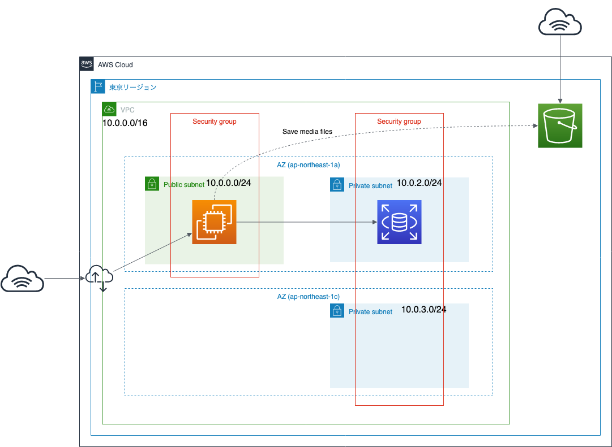
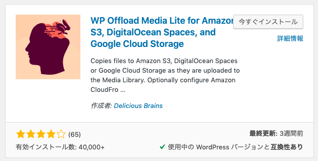

# Amazon EC2でWordPressサイトを立ち上げてみよう (オプション)

## 概要

このハンズオンでは、
Amazon EC2で起動しているWordPressサイトの
画像ファイルや動画ファイルなどの保存先をAmazon S3に変更し、
EC2が万が一停止や削除する必要がでた場合でも
ファイルを失わず安全に保存できるようにします。

またAmazon S3に保存することで、
S3から画像ファイル等を配信することが可能になります。
これによりEC2へのアクセス負荷を軽減することができます。

この章では、前章のEC2ハンズオンで構成したWordPressサイト環境を元に行うので、
前章のハンズオンを行なっていない方は事前に構築してください。

## 目的

このハンズオンでは、以下のことを行います。

- WordPressのメデイアファイルをS3に配置し、S3からメディアファイルを配信する
- 後片付けをする

## 全体図



## AWSマネジメントコンソールにアクセスする

1. [AWSのWebサイト](https://aws.amazon.com/jp/)にアクセスし、
    サイト右上にある「コンソールへログイン」をクリックします。
2. ログイン画面です。IAMユーザは「アカウント」には「アカウントID」を入れ、ユーザとパスワードにはIAMユーザのユーザ名とパスワードを入力します。
    ルートアカウントは、ユーザ名にルートアカウントのメールアドレスを入れ、パスワードにはルートアカウントのパスワードを入れます。
    必要事項を入力したら、「サインイン」をクリックします。
    - 多要素認証が有効な場合は、次の画面で認証トークンを入力します。
3. AWSマネジメントコンソールのトップページが開いたら完了です。

## 作業1: WordPressの画像ファイルをS3に配置し、S3から画像ファイルを配信する

WordPressは画像ファイル、動画ファイルなどのメディアファイルをつけてブログ投稿できますが、
その際のメディアファイルはEC2インスタンス上に保存されます。

EC2インスタンスが壊れて起動できなくなった場合やインスタンス削除した場合、
データはRDSに保存されていますが、メディアファイルは消えてしまいます。

また、WordPressサイトが起動するEC2インスタンスを複数台起動している場合、
どこかのEC2インスタンスに保存されたメディアファイルを
各EC2インスタンスにファイル同期しなければならず、
運用メンテナンスが大変です。

そこで、メディアファイルをAmazon S3に保存し、
S3から直接メディアファイルを配信することで、この問題を回避したいと思います。
S3から配信することで、EC2へのアクセス負荷軽減もおきます。


### 1-1. IAMロールの作成とEC2への権限付与

まず、WordPressが起動するEC2からS3にアクセスできるように、
IAMロールを使って権限を付与します。
本ハンズオンではすでに、
AWS Systems Managerにアクセスための権限(IAMポリシー)「AmazonEC2RoleforSSM」を付与した
IAMロール「RoleHandson20190622」がEC2に割り当てられているため、
このIAMロールにS3アクセス権限を追加します。

1. AWSマネジメントコンソールで右側に「東京」と表示されているか確認します。
    - 別のリージョン名が表示されていない場合は、リージョン名をクリックし「アジアパシフィック (東京)」を選択します。
2. AWSマネジメントコンソールで「サービス」から「IAM」をクリックします。
    - IAMダッシュボード画面が表示されます。
3. 左側メニューの「ロール」をクリックします。
4. ロール名「RoleHandson20190622」をクリックします。
5. アクセス権限タブの中から「ポリシーをアタッチします」をクリックします。
6. 以下の設定をして、「ポリシーのアタッチ」をクリックします。
    - ポリシー一覧の中から、「AmazonS3FullAccess」を選択
        - 検索テキストボックスに「S3」と入力すると一覧が絞られます。
7. 「RoleHandson20190622 にポリシー AmazonS3FullAccess がアタッチされました。」と表示されればOKです。

### 1-2. S3バケットの作成

次に、S3にファイルを保存する場所である「バケット」を作成します。
また、S3にパブリックアクセス設定ができる状態にしておきます。
オブジェクトを公開する設定自体は、WordPressプラグインが行ってくれます。

1. AWSマネジメントコンソールで「サービス」から「S3」をクリックします。
    - S3バケット一覧画面が表示されます。
2. 「バケットを作成する」をクリックします。
3. 以下の内容を設定して、「作成」をクリックします。
    - バケット名: jawsug-20190622-NUMBER
        - NUMBERを適当なランダムな番号に置き換えてください。
            バケット名は、全世界で一意になる必要があります。
    - リージョン: アジアパシフィック (東京)
4. S3バケット一覧に、先ほど作成したバケットが表示されていればOKです。
    - "The requested bucket name is not available"で始まるエラーが表示された場合は、すでに同じバケット名が世の中に存在していることを示しています。最初の「Edit」リンクをクリックしてバケット名を変更して再度作成してください。
5. 作成したバケット名をクリックします。
6. 「アクセス権限」タブをクリックします。
7. 「ブロックパブリックアクセス」を確認します。
    - 「パブリックアクセスをすべてブロック」が「オン」になっていると思います。
8. 「編集」をクリックします。
9. 「パブリックアクセスをすべてブロック」のチェックを外して、「保存」をクリックします。
10. テキストフィールドに「確認」と入力して、「確認」をクリックします。
    - 「パブリックアクセス設定が正常に更新されました」を表示されればOKです。

### 1-3. WordPressプラグインの導入

最後に、WordPressのプラグインを導入し、
メディアファイルを保存する先をS3にしたり、
メディアファイルを表示する際にS3のURLにしたりできるようにします。

- 参考: [WordPressの画像ファイルをS3に保存する(メディア機能連携) | つかびーの技術日記](http://tech-blog.tsukaby.com/archives/972)
- 参考: [WP Offload Media Lite for Amazon S3, DigitalOcean Spaces, and Google Cloud Storage - WordPress plugin | WordPress.org](https://wordpress.org/plugins/amazon-s3-and-cloudfront/)

1. Webブラウザで`http://<パブリックDNS名>/wp-login.php`にアクセスします。
2. 以下のように入力してログインします。
    - Username: user
    - Password: WordPressの管理者パスワード
3. WordPress管理画面の左側メニューから「プラグイン」をクリックします。
4. プラグイン検索に「s3」と入力してプラグインを検索し、
    その中で「WP Offload Media Lite for Amazon S3, DigitalOcean Spaces, and Google Cloud Storage」を探し、「今すぐインストール」をクリックします。
    - 
5. インストール完了後、「有効化」をクリックします。
6. プラグイン一覧が表示されるので、その中から「WP Offload Media Lite」の
    「Settings」をクリックします。
7. 以下の設定をして、「Next」をクリックします。
    - 「Amazon S3」を選択
    - 「My Server is on Amazon Web Services and I'd like to use IAM Roles」を選択
8. `wp-config.php`に以下の1行を追記する旨が記述されているので、以下の1行をコピーしておく。
    ```php
    define( 'AS3CF_AWS_USE_EC2_IAM_ROLE', true );
    ```
9. SSHでWordPressが起動しているEC2インスタンスにログインし、
    以下のコマンドを入力して、`wp-config.php`に先ほどコピーした1行を追記する。
    ```bash
    sudo nano /home/bitnami/apps/wordpress/htdocs/wp-config.php
    ```
    - 以下の1行を追記
    ```php
    /** DB設定の前に、追記しておくことにする **/
    define( 'AS3CF_AWS_USE_EC2_IAM_ROLE', true );
    ```
10. WordPress管理画面に戻り、先ほどのプラグインの設定画面を再度開く。
11. 「What bucket would you like to use?」と表示されているので、
    以下の設定をして、「Save Backet Setting」をクリックします。
    - Bucket: 先ほど作成したS3バケット名
12. 「設定を保存しました。」と表示され、「URL PREVIEW」にs3へのURLが記述されていればOKです。
13. WordPressの新規投稿をして、その際に適宜画像ファイルを一緒に投稿してみましょう。
    - 画像ファイルがS3にアップロードされ、画像ファイルのURLがS3へのURLになっていることを確認できればOKです。

## 作業2: 後片付けをする

最後に後片付けをしましょう。

1. AWSマネジメントコンソールで右側に「東京」と表示されているか確認します。
    - 別のリージョン名が表示されていない場合は、リージョン名をクリックし「アジアパシフィック (東京)」を選択します。
2. AWSマネジメントコンソールで「サービス」から「EC2」をクリックします。
    - EC2ダッシュボード画面が表示されます。

### 2-1. EC2インスタンスの削除

1. 左側メニューから「インスタンス」をクリックします。
2. 作成したEC2インスタンス「web1」を選択して、
    「アクション」⇒「インスタンスの状態」⇒「終了」をクリックします。
    - インスタンスの状態が「Terminated」になれば削除完了です。

### 2-2. RDSの削除

1. AWSマネジメントコンソールで「サービス」から「RDS」をクリックします。
    - RDSダッシュボード画面が表示されます。
2. 左側メニューから「データベース」をクリックします。
3. 作成したデータベースをチェックして、「アクション」⇒「削除」をクリックします。
4. 「最終スナップショットを作成しますか?」のチェックを外します。
5. 「インスタンスの削除後、...」のチェックを入れます。
6. テキストフィールドに「delete me」と入力して「削除」をクリックします。
    - ステータスが「削除中」になり、その後しばらくすると削除されます。
    - 削除には約10分程度かかります。
7. 左側メニューから「サブネットグループ」をクリックします。
8. 作成したRDSサブネットグループを選択して、「削除」をクリックします。
    - データベースがまだ「削除中」の場合は、サブネットグループは削除できません。
9. 今回のハンズオンではDBのスナップショットを作成していませんが、
    左側メニューから「スナップショット」を選択して、スナップショットがあった場合は削除してください。

### 2-3. S3の削除

1. AWSマネジメントコンソールで「サービス」から「S3」をクリックします。
    - S3バケット一覧画面が表示されます。
2. 今回作成したS3バケットを選択して「削除」をクリックします。
3. テキストフィールドにバケット名を入力して「確認」をクリックします。

### 2-4. IAMロールの削除

1. AWSマネジメントコンソールで「サービス」から「IAM」をクリックします。
    - IAMダッシュボード画面が表示されます。
2. 左側メニューの「ロール」をクリックします。
3. 今回作成したIAMロール「RoleHandson20190622」を選択して、
    「ロールの削除」をクリックします。
4. ロールを確認して「はい、削除」をクリックします。

### 2-5. セキュリティグループの削除

1. AWSマネジメントコンソールで「サービス」から「EC2」をクリックします。
    - EC2ダッシュボード画面が表示されます。
2. 左側メニューから「セキュリティグループ」をクリックします。
3. 今回作成したセキュリティグループを選択して、
    「アクション」⇒「セキュリティグループの削除」をクリックします。
    - 削除できない場合は、インバウンドのルールを編集して
        参照しているセキュリティグループのルールを削除してから再度グループ削除をしてみてください。

### 2-6. キーペアの削除

1. 左側メニューから「キーペア」をクリックします。
2. 今回作成したキーペアを選択して、「削除」をクリックします。

### 2-7. VPCの削除

1. AWSマネジメントコンソールで「サービス」から「VPC」をクリックします。
    - VPCダッシュボード画面が表示されます。
2. 左側メニューから「VPC」をクリックします。
3. 今回作成したVPC「vpc-handson-20190622」を選択して、
    「アクション」⇒「VPCの削除」をクリックします。
    - 関連付けられているサブネットやインターネットゲートウェイなども削除されます。
    - 誤ってDefault VPCを削除しないでください。
        Default VPCを削除してしまった場合は、
        AWSサポートにDefault VPC再作成を依頼する必要があります。

以上で、ハンズオンはすべて終了です。
お疲れ様でした。

---

## 付録: StaticPressを使用して、S3でホスティングする

「[StaticPress](http://ja.staticpress.net/)」というWordPressのプラグインを使用すると、
WordPressを静的なWebページに変換してくれます。

このWebページをS3でホスティングすると、様々な利点があります。

- EC2で動かすより、料金が安い
- サーバメンテナンスが不要
- 勝手にオートスケーリングしてくれる

例えば、WordPressで作ったイベントサイトを、
イベント終了後もそのまま残す際に、
S3でホスティングすると安く済みます。

## 参考

- [WordPress ウェブサイトを構築する](https://aws.amazon.com/jp/getting-started/projects/build-wordpress-website/)
